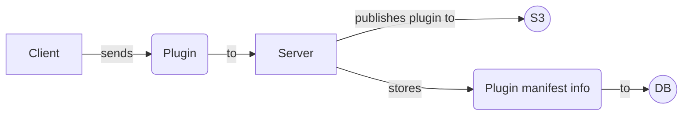
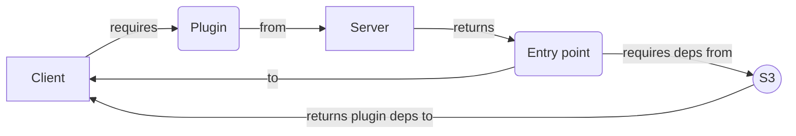

# Plugins

The following document outlines designs and considerations relative to the plugin data structure. It is still a work in 
progress and things might change depending upon requirements discovery.

## Data structure

A plugin name must be unique, whithin an organization context. There can be plugins with the same name but different
 organizations.

Keyspace: **Plugin**

Table: **summary**

This table stores the published plugins summary data. The plugin identifiers are extracted from the manifest file at publishing time.

Field           | Type | Description                                  | Key
----------------|------|----------------------------------------------|------------
id              | UUID | the unique identifier of the plugin          | Partition
subscription_id | UUID | the owner subscription id                    | 
name            | TEXT | the name of the plugin (must be unique)      | 
creator_id      | UUID | the plugin creator's account_id              | 
type            | TEXT | the plugin type                              |

#### Queries:
> - find_by_id

Table: **manifest_by_plugin_version**

When a plugin is published a new record is stored in the _manifest_by_plugin_version_ table. 
The primary key is given by the plugin_id and version string.

Field                | Type      | Description                                                    | Key
---------------------|-----------|----------------------------------------------------------------|----------------
plugin_id            | UUID      | the unique identifier for a published plugin                   | Partition
version              | TEXT      | version string (must follow semver and may include extra field)| Clustering
description          | TEXT      | the plugin description                                         |
screenshots          | SET<TEXT> | a set containing screenshots urls (**? not sure**)             |
thumbnail            | TEXT      | the plugin thumbnail url                                       |
author               | TEXT      | the name of the author as in the manifest                      |
email                | TEXT      | the email of the user as in the manifest                       |
configuration_schema | TEXT      | relative path to schema json file                              |

#### Queries:
> - find_by_plugin_id
> - find_by_plugin_id_version

Table: **version_by_plugin**

The following table holds information relative to published plugin version numbers. 
It allows to keep track and list all the available versions of a plugin as well as facilitating version validation on a 
publish event.
**WITH CLUSTERING ORDER BY (major DESC, minor DESC, patch DESC, release_date DESC)** 

Field       | Type      | Description                                            | Key
--------------|-----------|--------------------------------------------------------|---------------
plugin_id     | UUID      | the unique identifier for a published plugin           | Partition
major         | INT       | the plugin major version number                        | Clustering
minor         | INT       | the plugin minor version number                        | Clustering
patch         | INT       | the plugin patch version number                        | Clustering
release_date* | BIGINT    | timestamp of upload date                              | Clustering 
pre_release   | TEXT      | the plugin pre-release label (_e.g 1.0.0-**beta1**_)   | Clustering
build         | TEXT      | the plugin build label (_e.g 1.0.1-beta1+**der15w3**_) | Clustering

* **release_date** timestamp other than giving us historical context, also servers to order the pre-release versions, 
so using it will be possible to know which pre-release versions are the latest ones

#### Queries:
> - find_by_plugin_id
> - find_by_plugin_id_major
> - find_by_plugin_id_major_minor
> - find_by_plugin_id_major_minor_patch
> - find_by_plugin_id_major_minor_patch_label

Table: **view_by_plugin_version**

Each plugin might have more than one entry point depending upon the context on which it is invoked.
The following table stores all the entry point information for a given plugin version. 
View loads MUST provide a context.

Field            | Type      | Description                                                        | Key
-----------------|-----------|----------------------------------------------------------------|------------
plugin_id        | UUID      | the unique identifier for a published plugin                   | Partition
version          | TEXT      | version string (must follow semver and includes version label) | Partition
context          | TEXT      | the view context                                               | Partition
entry_point_path | TEXT      | the relative path for the plugin entry point                   |
entry_point_data | BLOB      | the actual content of the entry point file                     |
content_type     | TEXT      | the type of content for the entry file                         |
[public_dir]     | TEXT      | publicDir field of manifest view section, if present           | 
[editor_mode]    | TEXT      | editorMode field of manifest view section, if present          |

#### Queries:
> - find_by_plugin_id_version_context

## Diagrams

### Publishing a plugin

The server performs some validation, stores the relevant information from the manifest and publishes the plugin package 
to the cloud. Publishing a plugin should be a synchronous operation in RTM.

### Fetching a plugin

The client requires a plugin to the server. The server returns an entry point. When front loading is enabled the entry point will be the actual content of the plugin index file, when front loading is disabled the entry point is a relative url that points to the S3 bucket.

